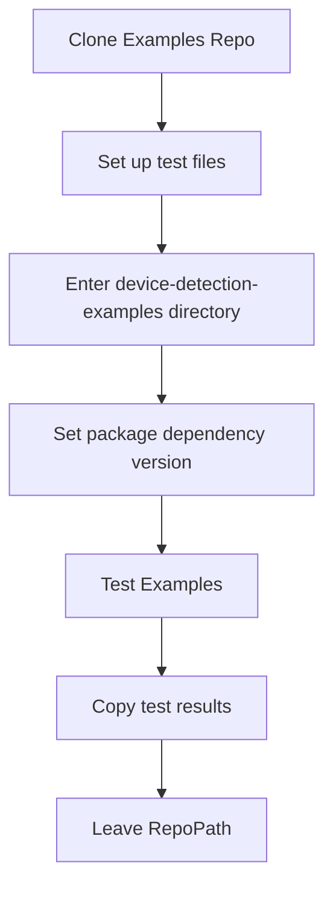

# API SPECIFIC CI/CD Approach

## Integration Tests

The integration testing approach differs from the 'general' inversion of control approach outlined in the [Design.md](https://github.com/51Degrees/common-ci/blob/gh-refact/design.md) as the it cannot be generic. 

The integration tests are conducted to verify the proper functioning of the device-detection-java-examples with the newly built packages. In order to do this, the integration tests use a locally built and installed version of the device-detection-java dependency created in the preceding stages of the pipeline. 

The below chart shows the process of running tests for the device-detection-java-examples. 

It performs the following steps:

1. Clone Examples Repo: Clone the "device-detection-java-examples" repository into the common-ci directory.
3. Set up test files: Move the TAC-HashV41.hash file to the device-detection-java-examples/device-detection-data directory and download Evidence and User-Agent files into device-detection-data directory.
4. Enter device-detection-examples directory: Changes the current working directory to the device-detection-java-examples folder.
5. Set package dependency version: Sets the version of the device-detection package dependency for the examples to the specified Version parameter. This will be the version installed in the local repository found in the .m2 folder.
6. Test Examples: Runs the Maven clean test command, passing the TestResourceKey, SuperResourceKey, and LicenseKey as parameters.
7. Copy test results: Copies the test results from the surefire-reports directory to the device-detection-java/test-results/integration directory.
Leave RepoPath: Changes the current working directory back to the initial location.

## Performance Tests

The performance tests are located in the examples project, therefore, all of the above applies to performance tests.

The output of the Performance Tests is written to the console. To enable the parsing of this output, the "redirectTestOutputToFile" option must be enabled in the examples project. This ensures that the test output is saved to a file, making it accessible for further processing.

The performance test results are then parsed and organized using a hashtable data structure. This approach facilitates the extraction of relevant metrics, such as detections per second and average milliseconds per detection that are then written to a file following the convention outlined in the [Design.md](https://github.com/51Degrees/common-ci/blob/gh-refact/design.md)
